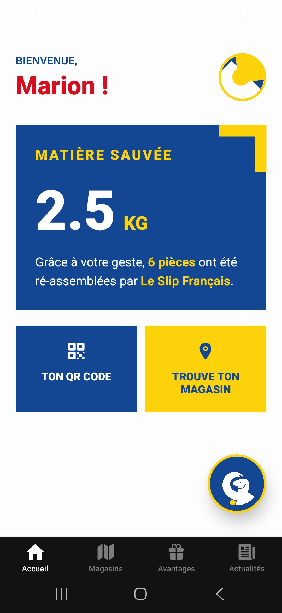
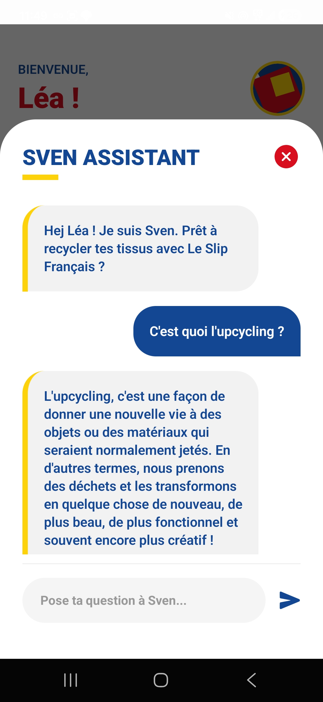
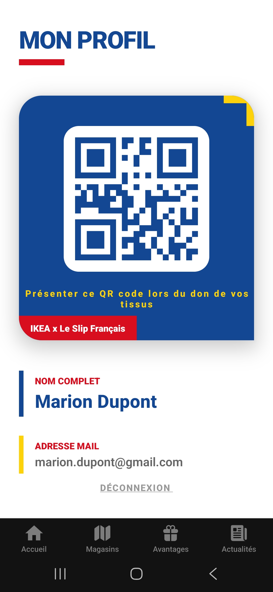
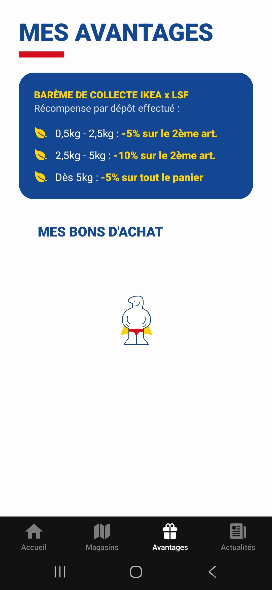
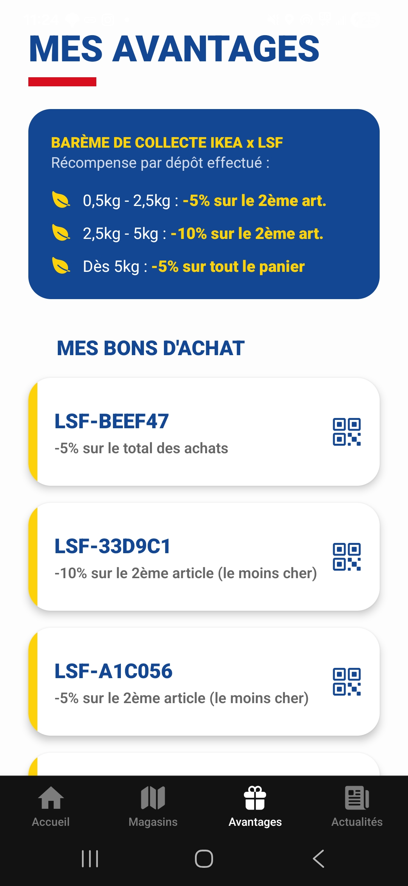
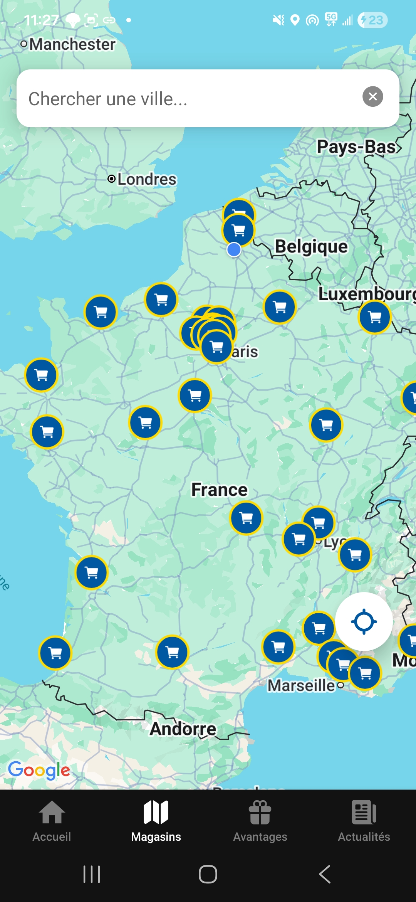

#  IKEA x Le Slip Français 

Bienvenue sur le dépôt de la collaboration **IKEA x Le Slip Français**. Ce projet est un projet **étudiant**. Il est donc **fictif** et aucune des deux marques ci dessus n'a été impliqué. Cette application mobile, développée avec **Expo** et **React Native**, permet aux utilisateurs de suivre les dépôts de tissus qu'ils ont fait, en gagnant des bons d'achat pour le prochains pop-Up Store.

##  Architecture Backend & Serveur

Le projet repose sur une architecture client-serveur robuste pour garantir la synchronisation des données :

* **Hébergement API** : Toutes les routes d'authentification, de gestion des utilisateurs et des statistiques sont hébergées sur un serveur distant (lemerovingien.fr).
* **Base de Données** : Une base de données MySQL centralise les informations (comptes utilisateurs, poids total déposé, informations de profil).
* **Technologies Backend** : 
  * **PHP** : Pour le traitement des requêtes et la logique métier.
  * **JSON** : Format d'échange standard entre l'application mobile et le serveur.
* **Sécurité des Sessions** : L'ID utilisateur récupéré via l'API est stocké localement de manière sécurisée pour maintenir la session et personnaliser l'expérience (notamment pour l'historique de Sven).


## Screenshots

<div style="display: flex; flex-direction: row; gap: 10px;">
     
   
   
   
   
   
   

</div>

##  Installation et Lancement

### 1. Prérequis
* Node.js (v18+)
* Expo Go sur votre smartphone (Android)

### 2. Installation
Clonez le dépôt et installez les dépendances :
```bash
git clone [https://github.com/Fanfaneee/Ikea_X_LeSlipFrancais.git](https://github.com/Fanfaneee/Ikea_X_LeSlipFrancais.git)
cd Ikea_X_LeSlipFrancais
npm install
```
Démarrer l'application : 
```bash
npx expo start
```
Scannez le QR code obtenu dans votre terminal avec votre téléphone.

### 3. Configuration des variables d'environnement
Créez un fichier `.env` à la racine du projet et ajoutez-y vos clés :
```env

EXPO_PUBLIC_HF_TOKEN=votre_token_hugging_face
EXPO_PUBLIC_GOOGLE_MAPS_API_KEY=votre_cle_google_maps
```

### 4.  Fonctionnalités principales

L'application **IKEA x Le Slip Français** combine engagement écologique et technologie pour offrir une expérience unique d'upcycling :

###  Gestion Utilisateur & Impact
* **Compte Personnel** : Chaque utilisateur accède à ses données via une session sécurisée (`SecureStore`).
* **Suivi de Matière Sauvée** : Visualisation dynamique du poids total de tissus IKEA déposés (en KG).
* **Équivalence Textile** : Calcul automatique du nombre de vêtements "Le Slip Français" créés grâce aux dons de l'utilisateur.

###  Sven : Assistant Intelligent (Chatbot)
* **Accès Flottant** : Une bulle interactive représentant Sven est disponible sur la Home pour un accès instantané.
* **Expertise Upcycling** : Sven répond à toutes les questions sur la transformation des tissus IKEA (draps, rideaux, housses).
* **Conversation Privée** : Grâce à l'ID utilisateur, l'historique des discussions est sauvegardé localement et reste strictement personnel.
* **Moteur IA Meta Llama 3.2** : Réponses fluides, modernes et expertes intégrées via l'API Hugging Face.

###  Localisation & Logistique
* **Cartographie Interactive** : Intégration de **Google Maps** pour localiser les points de collecte et magasins IKEA participants.
* **Parcours Donateur** : Accès rapide au QR Code personnel pour faciliter le dépôt de textile en magasin.

###  Design & Expérience (UX/UI)
* **Interface Hybride** : Un mélange des codes visuels d'IKEA (Bleu/Jaune) et du Slip Français pour une identité forte.
* **Modal de Chat Moderne** : Une interface de discussion fluide avec auto-scroll et gestion des états de chargement ("Sven écrit...").

